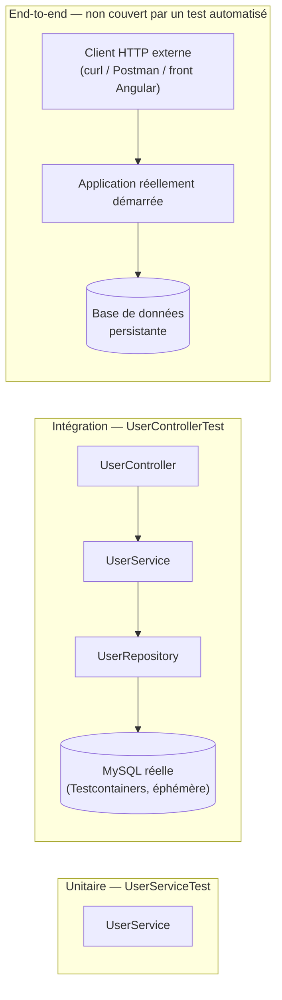

# Architecture des tests — état initial

Ce document décrit l'architecture de test **telle qu'elle existe aujourd'hui** dans `etudiant-backend` : deux fichiers de test, deux niveaux de granularité différents, et un périmètre fonctionnel qui ne couvre encore qu'une partie de l'API.

## Vue d'ensemble

| Fichier | Niveau | Couche testée | Dépendances réelles vs. simulées |
| --- | --- | --- | --- |
| [`UserServiceTest`](../src/test/java/com/openclassrooms/etudiant/service/UserServiceTest.java) | Unitaire | `UserService` seul | Tout le reste (`UserRepository`, `PasswordEncoder`) est mocké (Mockito) |
| [`UserControllerTest`](../src/test/java/com/openclassrooms/etudiant/controller/UserControllerTest.java) | Intégration | `UserController` → `UserService` → `UserRepository` → base réelle | Contexte Spring complet + vraie base MySQL (Testcontainers), HTTP simulé en mémoire (MockMvc) |

Aucun test ne va jusqu'au end-to-end (appel HTTP réel contre l'application réellement démarrée) — voir [Ce qui n'est pas couvert](#ce-qui-nest-pas-couvert).

## Les trois niveaux de test, et où se situe ce projet



- **Unitaire** : une seule classe, tout le reste mocké. Rapide (millisecondes), ne nécessite ni Docker ni base de données.
- **Intégration** : plusieurs couches réelles ensemble, y compris une vraie base de données — mais l'appel HTTP lui-même est simulé en mémoire par `MockMvc`, sans aller-retour réseau. Plus lent (~20 secondes, le temps que le conteneur MySQL démarre), nécessite Docker.
- **End-to-end** : ce qu'on a fait manuellement (curl, collection Postman via Newman) pendant le développement des routes `/api/login` et `/api/students`, mais qui n'existe dans aucun fichier de test versionné du repo.

## `UserServiceTest` — test unitaire

```java
@ExtendWith(SpringExtension.class)
public class UserServiceTest {
    @Mock private UserRepository userRepository;
    @Mock private PasswordEncoder passwordEncoder;
    @InjectMocks private UserService userService;
```

Mockito injecte les mocks directement dans une instance de `UserService` — aucun contexte Spring n'est réellement démarré (`@ExtendWith(SpringExtension.class)` sert ici uniquement pour l'intégration avec l'extension JUnit, pas pour charger l'`ApplicationContext`). Trois cas couverts sur `UserService.register()` :

| Test | Scénario | Assertion |
| --- | --- | --- |
| `test_create_null_user_throws_IllegalArgumentException` | `register(null)` | Lève `IllegalArgumentException` |
| `test_create_already_exist_user_throws_IllegalArgumentException` | Le `userRepository` mocké renvoie un utilisateur existant pour ce login | Lève `IllegalArgumentException` |
| `test_create_user` | Cas nominal : login libre | `userRepository.save(...)` est appelé avec l'utilisateur attendu (capturé via `ArgumentCaptor`) |

## `UserControllerTest` — test d'intégration

```java
@SpringBootTest(webEnvironment = SpringBootTest.WebEnvironment.RANDOM_PORT)
@AutoConfigureMockMvc
@Testcontainers
public class UserControllerTest {

    @Container
    static MySQLContainer mySQLContainer = new MySQLContainer("mysql:latest");
```

- `@SpringBootTest` démarre **tout le contexte Spring** (tous les beans réels : `UserController`, `UserService`, `UserRepository`, `PasswordEncoder`, la sécurité...).
- `@Testcontainers` + `@Container` démarrent un **vrai conteneur Docker MySQL**, jetable, dédié à ce test.
- `@DynamicPropertySource` redirige la datasource Spring vers ce conteneur (au lieu de la base de dev de `.env`), avec `ddl-auto: create` pour repartir d'un schéma vierge.
- `@AfterEach` vide la table `user` après chaque test pour l'isolation entre tests.
- `MockMvc` simule les requêtes HTTP en mémoire (pas de vrai port réseau sollicité, malgré `RANDOM_PORT`).

Trois cas couverts sur `POST /api/register` :

| Test | Given | Attendu |
| --- | --- | --- |
| `registerUserWithoutRequiredData` | `RegisterDTO` vide | `400 Bad Request` (validation `@NotBlank`) |
| `registerAlreadyExistUser` | Utilisateur déjà créé (via le service, en direct), puis re-inscription du même login en HTTP | `400 Bad Request` |
| `registerUserSuccessful` | `RegisterDTO` valide | `201 Created` |

## Pré-requis d'exécution

| Test | Pré-requis |
| --- | --- |
| `UserServiceTest` | Aucun — JVM seule |
| `UserControllerTest` | Docker disponible et démarré (`docker info` doit répondre) |

**Point d'attention historique** : `UserControllerTest` a longtemps échoué dans cet environnement de développement avec `Could not find a valid Docker environment` — Testcontainers 1.20.0 sonde la connectivité Docker avec une version d'API codée en dur (1.32), rejetée par les versions récentes de Docker Engine (`MinAPIVersion` relevé à 1.40+). Corrigé en migrant vers **Testcontainers 2.0.5** (renommage des artefacts Maven `junit-jupiter`/`mysql` → `testcontainers-junit-jupiter`/`testcontainers-mysql`, classes Java inchangées à l'exception de `MySQLContainer` qui a une nouvelle localisation non générique : `org.testcontainers.mysql.MySQLContainer` au lieu de `org.testcontainers.containers.MySQLContainer`, désormais dépréciée).

## Ce qui n'est pas couvert

Le périmètre testé se limite à `UserService.register()` et `POST /api/register`. Tout le reste du code ajouté depuis n'a aucun test automatisé :

| Code | Statut |
| --- | --- |
| `UserService.login()` | ❌ aucun test |
| `POST /api/login` | ❌ aucun test |
| `JwtService` (génération + validation de token) | ❌ aucun test |
| `JwtAuthenticationFilter` | ❌ aucun test |
| `StudentController` (5 routes CRUD) | ❌ aucun test |
| `StudentService` | ❌ aucun test |
| `RestExceptionHandler` (handlers 401/403/404/500) | ❌ aucun test |

Tout ce périmètre a été vérifié **manuellement** pendant le développement (curl, collection Postman exécutée via Newman, navigateur piloté par Playwright pour le front) — voir [security.md](security.md) et la collection dans [postman/](postman/) — mais rien de tout cela n'est rejoué automatiquement à chaque `mvn test`.

> **Playwright, c'est quoi ?** Une bibliothèque d'automatisation de navigateur (comme Selenium) : elle pilote un vrai navigateur par code — cliquer, remplir des formulaires, naviguer, capturer des écrans — pour dérouler un scénario comme le ferait un humain. Elle a servi ponctuellement, pendant le développement du front Angular, à vérifier en conditions réelles le parcours inscription → connexion → CRUD étudiant (création, liste, détail, édition, suppression) contre le `ng serve` et le backend réellement démarrés. C'était une vérification manuelle ad hoc, pas un test automatisé versionné dans le repo (aucun fichier `*.spec.ts` n'en a résulté) — d'où sa place ici, dans les vérifications manuelles, et non dans le tableau des tests automatisés.
