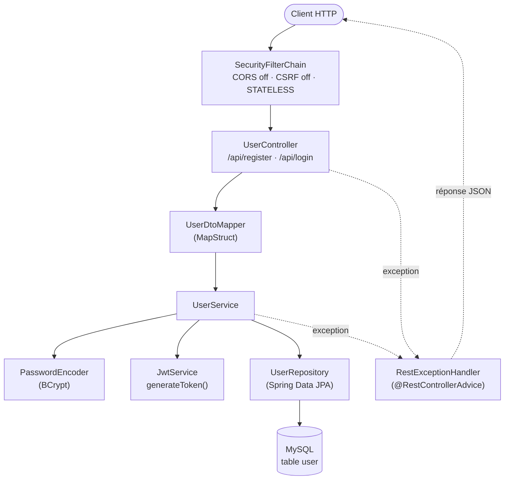
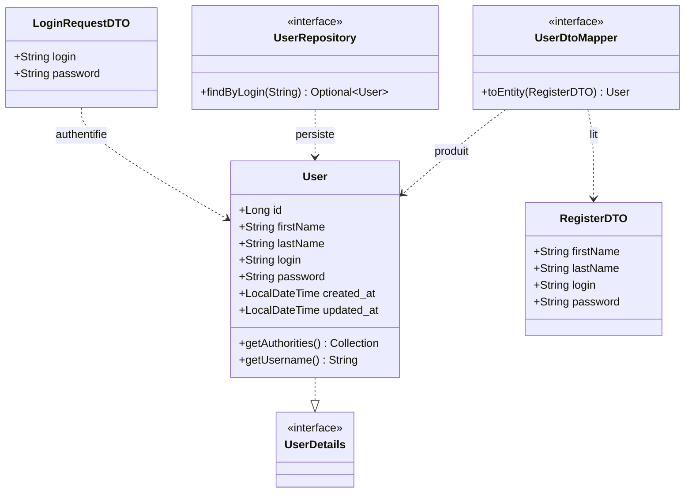
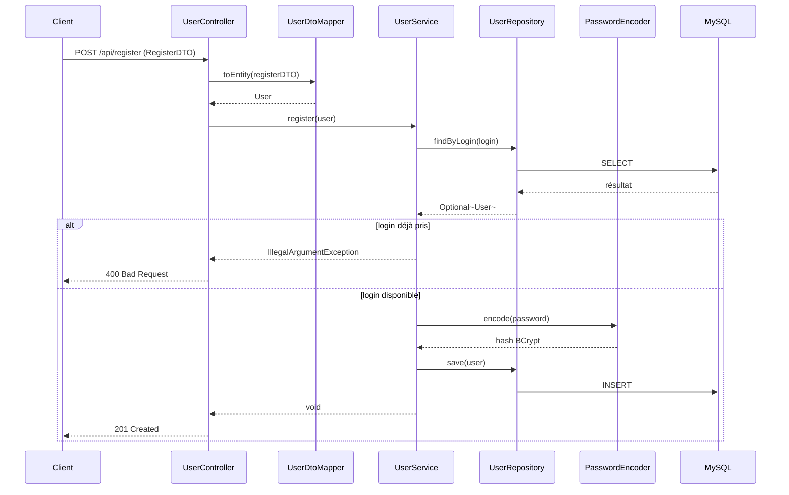
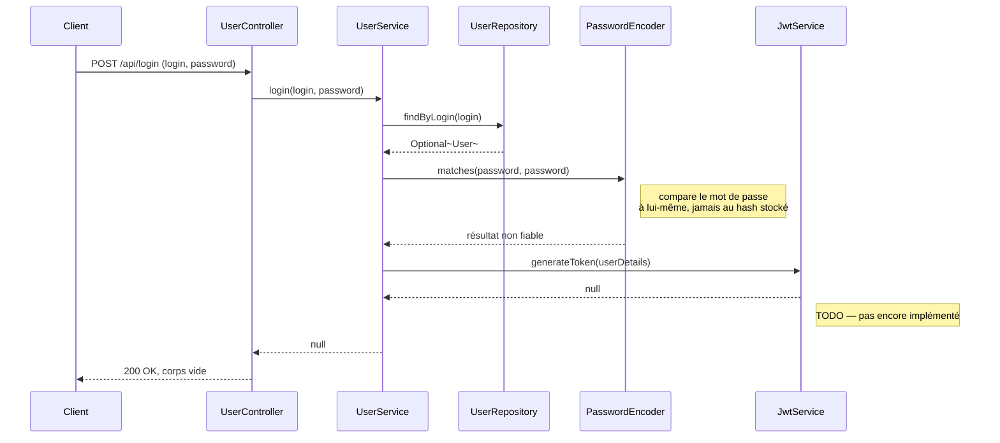

# Documentation en ligne

Version interactive de [architecture.md](architecture.md) (avec rendu Mermaid natif) :

https://claude.ai/code/artifact/87c5705b-c228-4e46-a10a-a98052e08ec8

# etudiant-backend — architecture et fonctionnement

Microservice Spring Boot qui gère les comptes des agents de la bibliothèque (inscription, authentification) et, à terme, le CRUD des étudiants. Exercice OpenClassrooms « Testez et améliorez une app ».

| Runtime | Framework         | Build            | Base de données                                              | Port HTTP |
| ------- | ----------------- | ---------------- | ------------------------------------------------------------ | --------- |
| Java 21 | Spring Boot 3.5.5 | Maven (`./mvnw`) | MySQL (image `mysql:latest`, 26.7 au moment de la rédaction) | 8080      |

## Vue d'ensemble

Le service expose aujourd'hui deux routes publiques : la création d'un compte agent (`POST /api/register`) et sa connexion (`POST /api/login`). Le README du projet liste aussi des APIs CRUD pour les étudiants de la bibliothèque, marquées « à faire » — elles n'existent pas encore dans le code.

L'architecture suit le découpage classique d'une application Spring Boot : un contrôleur REST reçoit la requête, un mapper MapStruct la convertit en entité, un service applique la logique métier, un repository Spring Data JPA persiste en base MySQL. Spring Security encadre l'ensemble via une chaîne de filtres sans état (JWT), et un `@RestControllerAdvice` centralise la traduction des exceptions en réponses HTTP.

## Stack technique

| Rôle            | Bibliothèque                     | Usage dans le projet                                          |
| --------------- | -------------------------------- | ------------------------------------------------------------- |
| Web             | `spring-boot-starter-web`        | Contrôleur REST, sérialisation JSON                           |
| Persistance     | `spring-boot-starter-data-jpa`   | `UserRepository`, entité `User`                               |
| Sécurité        | `spring-boot-starter-security`   | Filtre stateless, BCrypt, `DaoAuthenticationProvider`         |
| Validation      | `spring-boot-starter-validation` | Annotations `@NotBlank` sur les DTO                           |
| Mapping         | MapStruct                        | `UserDtoMapper` : DTO → entité                                |
| Boilerplate     | Lombok                           | `@Data`, `@RequiredArgsConstructor`, `@Slf4j`                 |
| Base de données | MySQL + `mysql-connector-j`      | conteneur défini dans `compose.yaml`                          |
| Supervision     | `spring-boot-starter-actuator`   | endpoints `/actuator/**`, en accès public                     |
| Tests           | JUnit 5, Mockito, Testcontainers | tests unitaires + tests d'intégration sur vrai MySQL éphémère |

### Starters Spring Boot

Le projet utilise 6 _starters_ Spring Boot :

| Starter                          | Rôle                                              |
| -------------------------------- | ------------------------------------------------- |
| `spring-boot-starter-web`        | API REST (Tomcat embarqué, Jackson)               |
| `spring-boot-starter-data-jpa`   | Persistance JPA/Hibernate (`UserRepository`)      |
| `spring-boot-starter-security`   | Authentification, BCrypt, chaîne de filtres       |
| `spring-boot-starter-validation` | Annotations `@NotBlank` sur les DTO               |
| `spring-boot-starter-actuator`   | Endpoints de supervision `/actuator/**`           |
| `spring-boot-starter-test`       | JUnit 5, Mockito, AssertJ, MockMvc (scope `test`) |

Plus deux dépendances liées mais qui ne sont **pas** des starters à proprement parler :

- `spring-boot-docker-compose` (scope `runtime`) — démarre automatiquement `compose.yaml` au lancement de l'app
- `mysql-connector-j` (scope `runtime`) — driver JDBC MySQL

## Arborescence

Dix-sept fichiers Java au total, organisés par rôle plutôt que par fonctionnalité — un seul domaine (`User`) existe pour l'instant.

```
src/main/java/com/openclassrooms/etudiant/
├── EtudiantBackendApplication.java        # point d'entrée @SpringBootApplication
├── configuration/
│   ├── AppConfig.java                     # charge le fichier .env comme PropertySource
│   ├── logging/
│   │   └── RequestLoggingFilterConfig.java
│   └── security/
│       ├── SpringSecurityConfig.java      # chaîne de filtres, BCrypt, routes publiques
│       └── CustomUserDetailService.java   # UserDetailsService branché sur UserRepository
├── controller/
│   └── UserController.java                # POST /api/register, POST /api/login
├── dto/
│   ├── RegisterDTO.java
│   └── LoginRequestDTO.java
├── entities/
│   └── User.java                          # @Entity, implements UserDetails
├── handler/
│   ├── RestExceptionHandler.java          # @RestControllerAdvice
│   └── ErrorDetails.java
├── mapper/
│   └── UserDtoMapper.java                 # interface MapStruct
├── repository/
│   └── UserRepository.java                # JpaRepository<User, Long>
└── service/
    ├── UserService.java                   # register(), login()
    └── JwtService.java                    # generateToken() — TODO

src/test/java/com/openclassrooms/etudiant/
├── controller/UserControllerTest.java     # Testcontainers + MockMvc
└── service/UserServiceTest.java           # Mockito
```

## Architecture en couches

Chaque requête HTTP traverse la chaîne de filtres Spring Security avant d'atteindre le contrôleur. Celui-ci délègue toute la logique au service, qui est la seule couche à parler au repository, à l'encodeur de mot de passe et au service JWT.



La ligne `.addFilterBefore(...)` qui brancherait un filtre JWT dans `SpringSecurityConfig` est commentée : aucun filtre ne lit de token pour l'instant, seule la chaîne standard s'applique.

## Modèle de données

`User` est à la fois l'entité JPA persistée et l'objet `UserDetails` consommé par Spring Security — les deux responsabilités sont portées par la même classe.



`UserDtoMapper` ignore explicitement `id`, `created_at`, `updated_at` et `authorities` lors de la conversion — seuls les quatre champs saisis par l'agent sont copiés.

## Flux d'inscription



## Flux de connexion

Ce flux existe dans le code mais ne fonctionne pas encore de bout en bout — voir les deux points signalés dans le diagramme et détaillés plus bas.



## Sécurité HTTP

La chaîne est **stateless** (pas de session), CSRF et CORS désactivés, et l'authentification passe par un `DaoAuthenticationProvider` adossé à `CustomUserDetailService`.

| Route             | Accès       | Remarque                                                                    |
| ----------------- | ----------- | --------------------------------------------------------------------------- |
| `/actuator/**`    | public      | supervision                                                                 |
| `/api/register`   | public      | création de compte agent                                                    |
| `/api/login`      | public      | authentification                                                            |
| toute autre route | authentifié | aucune route protégée n'existe encore ; le futur CRUD étudiants viendra ici |

## Points d'attention

Cohérent avec l'objectif de l'exercice (« Testez et améliorez une app ») : ce sont des manques à corriger, pas des régressions.

- **Bug** — `UserService.login()` appelle `passwordEncoder.matches(password, password)` au lieu de `matches(password, user.getPassword())` : le mot de passe n'est jamais vérifié contre le hash stocké en base.
- **Todo** — `JwtService.generateToken()` retourne `null` : aucun token n'est réellement émis, donc `/api/login` ne peut pas fonctionner de bout en bout.
- **Todo** — Le filtre de lecture du JWT n'est pas branché dans `SpringSecurityConfig` (ligne `.addFilterBefore(...)` commentée) : impossible de protéger une route par token pour l'instant.
- **Bug** — `RestExceptionHandler` importe `java.nio.file.AccessDeniedException` au lieu de `org.springframework.security.access.AccessDeniedException` : le handler ne pourra jamais intercepter un refus d'accès Spring Security.
- **Manque** — Les APIs CRUD des étudiants annoncées dans le README ne sont pas encore implémentées.

## Tests existants

| Fichier              | Type                                   | Couverture                                                        |
| -------------------- | -------------------------------------- | ----------------------------------------------------------------- |
| `UserServiceTest`    | Unitaire (Mockito)                     | `register()` : utilisateur nul, login déjà pris, création réussie |
| `UserControllerTest` | Intégration (Testcontainers + MockMvc) | `POST /api/register` : validation, doublon, succès (201)          |

Aucun test ne couvre encore `/api/login` ni `JwtService` — cohérent avec leur état inachevé.

## Démarrer le projet

```bash
docker compose up -d          # MySQL sur le port 3306, cf. compose.yaml
./mvnw spring-boot:run        # nécessite Java 21 — voir .envrc / direnv
./mvnw clean test             # lance aussi un conteneur MySQL jetable via Testcontainers
```

Les identifiants de connexion (`DB_USER`, `DB_PASSWORD`, `DB_NAME`) sont lus depuis `.env` par `AppConfig`, qui l'enregistre comme `PropertySource` Spring — c'est ce qui permet à `application.yml` de résoudre `${DB_HOST}` et consorts sans variables d'environnement système.
