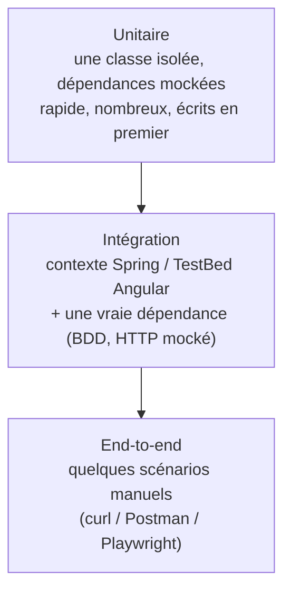

# Plan de tests à écrire — back et front

Liste des cas de tests restant à écrire pour couvrir les zones identifiées comme non testées dans [archi_test_ini.md](archi_test_ini.md) (JWT, CRUD étudiants, services/écrans Angular).

## Étape actuelle : écriture des tests back-end (Mockito + JUnit)

Objectifs formels de cette étape, qui **remplacent** la contrainte "pas de cas d'erreur" posée à l'étape précédente (celle-ci ne concernait que le premier passage de planification) :

- **Tous les services** (`JwtService`, `StudentService`, `UserService`) sont testés avec des **tests unitaires** (JUnit + Mockito).
- **Tous les nouveaux controllers** (`StudentController`, et le complément de `UserController`) sont testés avec des **tests d'intégration**, en s'inspirant de la configuration Testcontainers déjà en place dans `UserControllerTest`.
- Un **rapport de couverture de code** est généré côté back-end, avec un **seuil minimum de 80 %**.
- Chaque test se concentre sur **un seul cas ou comportement précis**, porte un **commentaire expliquant ce qu'il vérifie**, et est validé individuellement (exécuté avec succès) avant de passer au suivant.
- Contrainte conservée de l'étape précédente : pas de vérification d'effets de bord internes (`verify(mock).méthode(...)`) quand une assertion sur la valeur retournée suffit — sauf quand il n'y a pas d'autre moyen d'observer le comportement (ex. `delete()`, qui ne retourne rien).

Pour atteindre 80 %, les cas d'erreur/limites (exceptions, 400/404/401) rejoignent donc le plan ci-dessous, en plus des cas nominaux déjà listés précédemment.

### Mise en place de la couverture de code (JaCoCo)

Le projet n'a pas encore de plugin de couverture configuré. À ajouter dans `pom.xml`, section `<build><plugins>` :

```xml
<plugin>
    <groupId>org.jacoco</groupId>
    <artifactId>jacoco-maven-plugin</artifactId>
    <version>0.8.12</version>
    <executions>
        <execution>
            <goals>
                <goal>prepare-agent</goal>
            </goals>
        </execution>
        <execution>
            <id>report</id>
            <phase>test</phase>
            <goals>
                <goal>report</goal>
            </goals>
        </execution>
        <execution>
            <id>check</id>
            <phase>verify</phase>
            <goals>
                <goal>check</goal>
            </goals>
            <configuration>
                <rules>
                    <rule>
                        <element>BUNDLE</element>
                        <limits>
                            <limit>
                                <counter>LINE</counter>
                                <value>COVEREDRATIO</value>
                                <minimum>0.80</minimum>
                            </limit>
                        </limits>
                    </rule>
                </rules>
            </configuration>
        </execution>
    </executions>
</plugin>
```

`mvn test` génère alors le rapport HTML dans `target/site/jacoco/index.html` ; `mvn verify` échoue si la couverture globale passe sous 80 %.

---

## Pyramide des tests



On commence par la base (unitaire), la plus rapide à écrire et à exécuter, avant de monter vers l'intégration. Au sein de chaque niveau, on part du service/controller le plus simple vers le plus complexe.

---

## Back-end

### Tests unitaires sur les services

Du plus simple (aucune dépendance à mocker) au plus complexe (plusieurs collaborateurs, plusieurs méthodes).

#### 1. `JwtService` — le plus simple : pas de dépendance mockée

| Cas | Entrée | Sortie attendue |
| --- | --- | --- |
| Génère un token | `UserDetails` avec `username = "alice"` | Chaîne non nulle au format `xxx.yyy.zzz` (3 segments séparés par `.`) |
| Extrait le login d'un token | Un token généré pour `"alice"` | `"alice"` |
| Valide un token cohérent | Le même token + `UserDetails` de `"alice"` | `true` |
| **Rejette un token dont le login ne correspond pas** | Token généré pour `"alice"` + `UserDetails` de `"bob"` | `false` |
| **Rejette un token expiré** | `JwtService` avec une expiration déjà passée (ex. `expirationMs = -1000` via `ReflectionTestUtils.setField`) + token généré avec cette config | `false` (ou exception `ExpiredJwtException` selon la méthode testée — à documenter dans le commentaire du test) |
| **Rejette un token signé avec une autre clé** | Token signé avec un `JwtService` configuré avec un secret différent | `extractUsername`/`isTokenValid` lève `JwtException` (signature invalide) |

#### 2. `StudentService` — une seule dépendance à mocker (`StudentRepository`)

| Cas | Entrée | Sortie attendue |
| --- | --- | --- |
| Création | `Student("Ada", "Lovelace", "ada@mail.com", ...)`, email libre (mock `findByEmail` → vide) | Le `Student` sauvegardé (retourné tel quel par le mock `save`) |
| **Création avec email déjà utilisé** | Même email qu'un étudiant existant (mock `findByEmail` → présent) | Lève `IllegalArgumentException` |
| Liste complète | — (mock `findAll` renvoie une liste de 2 étudiants) | Cette même liste de 2 éléments |
| Recherche par id | `id = 1` (mock `findById` renvoie un étudiant) | Le `Student` correspondant |
| **Recherche par id inexistant** | `id = 99` (mock `findById` → vide) | Lève `StudentNotFoundException` |
| Modification | `id = 1` + champs modifiés, email inchangé (mock `findById` + `save`) | Le `Student` avec les champs mis à jour |
| **Modification avec email pris par un autre étudiant** | `id = 1` + email appartenant à `id = 2` (mock `findByEmail` → id 2) | Lève `IllegalArgumentException` |
| **Modification d'un id inexistant** | `id = 99` (mock `findById` → vide) | Lève `StudentNotFoundException` |
| Suppression | `id = 1` existant (mock `findById` → présent) | Aucune exception levée (seul comportement observable pour une méthode `void` : `repository.delete(...)` a été invoqué) |
| **Suppression d'un id inexistant** | `id = 99` (mock `findById` → vide) | Lève `StudentNotFoundException` |

#### 3. `UserService` — le plus complexe : 3 dépendances mockées, 2 méthodes (complète `UserServiceTest` existant)

| Cas | Entrée | Sortie attendue |
| --- | --- | --- |
| *(déjà couverts)* `register()` : utilisateur nul, login déjà pris, création réussie | — | — |
| Connexion réussie | Login/mot de passe valides (mock repository + encoder + jwtService) | Chaîne de token non nulle (celle retournée par le mock `JwtService`) |
| **Connexion avec login inconnu** | Login absent (mock `findByLogin` → vide) | Lève `IllegalArgumentException` |
| **Connexion avec mauvais mot de passe** | Login existant, mot de passe ne correspondant pas au hash (mock `passwordEncoder.matches` → `false`) | Lève `IllegalArgumentException` |

### Tests d'intégration sur les controllers

Du plus simple (peu de routes/cas) au plus complexe (CRUD complet + sécurité).

#### 1. `UserControllerTest` — complète l'existant, 1 route restante (`/api/login`)

| Cas | Entrée | Sortie attendue |
| --- | --- | --- |
| *(déjà couverts)* `/api/register` : champs manquants, doublon, succès | — | — |
| `POST /api/login` réussi | `LoginRequestDTO` avec identifiants valides d'un utilisateur préalablement enregistré | `200 OK`, corps `{ "token": "<JWT>" }` (token non vide) |
| **`POST /api/login` avec identifiants invalides** | Login inexistant ou mot de passe erroné | `400 Bad Request` |

#### 2. `StudentControllerTest` — le plus complexe : nouveau fichier, 5 routes, dimension sécurité (avec/sans token) en plus du CRUD

Même pattern Testcontainers + MockMvc que `UserControllerTest`. Pour obtenir un token valide dans le test, enregistrer un utilisateur puis appeler `/api/login` (ou construire un token directement via `JwtService` injecté dans le contexte de test).

| Cas | Entrée | Sortie attendue |
| --- | --- | --- |
| Création | `POST /api/students` + `StudentRequestDTO` valide + token valide | `201 Created`, corps = `StudentResponseDTO` avec un `id` généré et les champs saisis |
| **Création sans token** | `POST /api/students` sans header `Authorization` | `401 Unauthorized` |
| **Création avec champs invalides** | `StudentRequestDTO` avec `email` vide ou mal formé + token valide | `400 Bad Request` |
| **Création avec email déjà utilisé** | Email d'un étudiant déjà créé + token valide | `400 Bad Request` |
| Liste | `GET /api/students` + token valide (un étudiant déjà créé) | `200 OK`, tableau contenant cet étudiant |
| Détail | `GET /api/students/{id}` + token valide, `id` d'un étudiant existant | `200 OK`, corps = cet étudiant |
| **Détail introuvable** | `GET /api/students/{id}` avec un `id` inexistant + token valide | `404 Not Found` |
| Modification | `PUT /api/students/{id}` + nouveaux champs + token valide | `200 OK`, corps = étudiant avec champs mis à jour |
| **Modification introuvable** | `PUT /api/students/{id}` avec un `id` inexistant + token valide | `404 Not Found` |
| Suppression | `DELETE /api/students/{id}` + token valide | `204 No Content` |
| **Suppression introuvable** | `DELETE /api/students/{id}` avec un `id` inexistant (ou déjà supprimé) + token valide | `404 Not Found` |

### Ce que ces tests couvrent indirectement

`JwtAuthenticationFilter` et `RestExceptionHandler` n'ont pas besoin de classe de test dédiée : les cas `StudentControllerTest` "sans token"/"token valide" exercent déjà le filtre de bout en bout, et chaque cas d'erreur (400/401/404) exerce le handler d'exception correspondant. Vérifier après coup, dans le rapport JaCoCo, que leur taux de couverture est bien remonté en conséquence — sinon, ajouter les cas manquants ciblés sur ces deux classes.

---

## Front-end (Angular)

*Portée non demandée par l'étape actuelle (back-end uniquement) — plan conservé tel quel pour une prochaine itération.*

### Tests unitaires

#### `authGuard`

| Cas | Entrée | Sortie attendue |
| --- | --- | --- |
| Utilisateur connecté | `localStorage` contient un `jwt` | `true` (navigation autorisée) |

#### `jwtInterceptor`

| Cas | Entrée | Sortie attendue |
| --- | --- | --- |
| Token présent | Requête sortante + `jwt` en `localStorage` | La requête interceptée porte le header `Authorization: Bearer <token>` |

#### `UserService.isLoggedIn()`

| Cas | Entrée | Sortie attendue |
| --- | --- | --- |
| Token présent | `localStorage` contient un `jwt` | `true` |

#### `StudentService` (même pattern que `user.service.spec.ts` : `HttpTestingController`)

| Cas | Entrée | Sortie attendue |
| --- | --- | --- |
| `getAll()` | Réponse mockée = liste de 2 `StudentResponse` | L'observable émet cette même liste |
| `getById(id)` | Réponse mockée = un `StudentResponse` | L'observable émet cet objet |
| `create(student)` | `StudentRequest` envoyé, réponse mockée = `StudentResponse` avec `id` | L'observable émet ce `StudentResponse` |
| `update(id, student)` | `StudentRequest` envoyé, réponse mockée | L'observable émet le `StudentResponse` mis à jour |

### Tests d'intégration (composants, `TestBed` + service mocké)

| Cas | Entrée | Sortie attendue |
| --- | --- | --- |
| `StudentListComponent` au chargement | `StudentService.getAll()` mocké → liste de 2 étudiants | `component.students` contient ces 2 étudiants |
| `StudentDetailComponent` au chargement | Route avec `id = 1`, `StudentService.getById()` mocké | `component.student` = l'étudiant retourné |
| `StudentFormComponent` en création, soumission valide | Formulaire rempli avec des valeurs valides, `StudentService.create()` mocké | Le service est appelé avec un `StudentRequest` correspondant aux valeurs du formulaire, puis navigation vers `/students` |
| `StudentFormComponent` en édition, chargement | Route avec `id = 1`, `StudentService.getById()` mocké | Le formulaire est pré-rempli avec les valeurs de l'étudiant retourné |

---

## Ordre de rédaction suggéré

1. `JwtService` (le plus simple : pas de mock, pas de contexte)
2. `StudentService` (unitaire, un seul mock)
3. Complément `UserServiceTest` (unitaire, le plus de dépendances)
4. Ajout du plugin JaCoCo au `pom.xml`, premier rapport de référence (probablement < 80 % à ce stade)
5. Complément `UserControllerTest` (`/api/login`, intégration)
6. `StudentControllerTest` (intégration, le plus de cas — CRUD + sécurité)
7. Relecture du rapport JaCoCo : combler les lignes/branches non couvertes restantes jusqu'au seuil de 80 %
8. *(Itération suivante, hors périmètre actuel)* Tests front Angular listés ci-dessus
