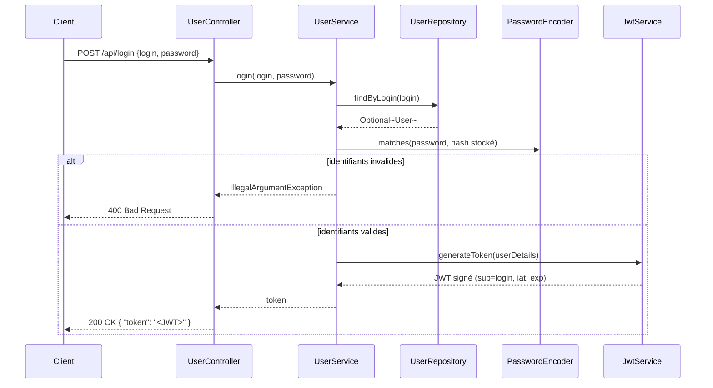
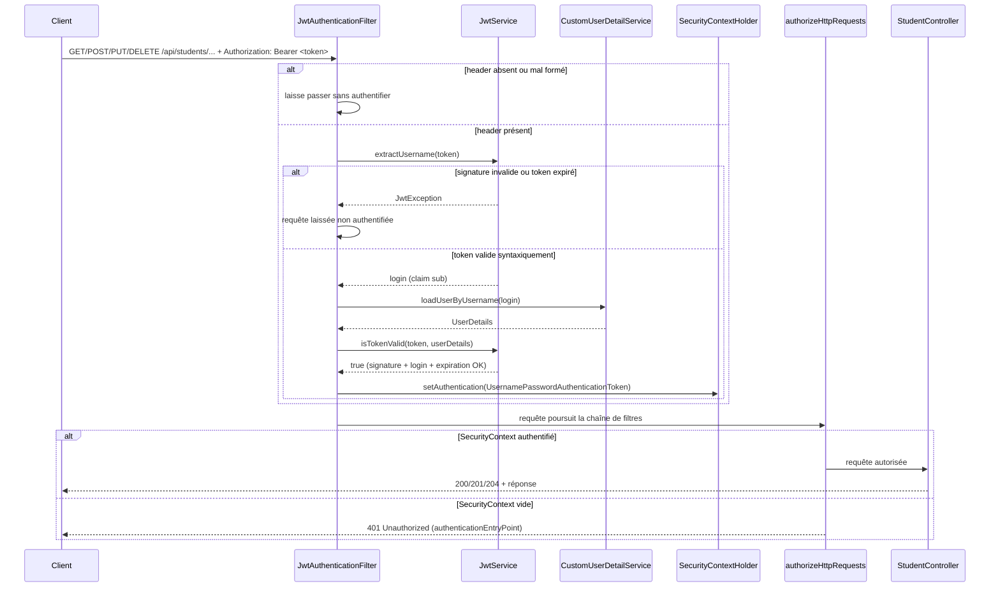

# Sécurité — authentification JWT et routes protégées

Ce document décrit le mécanisme d'authentification par JWT (JSON Web Token) mis en place pour `etudiant-backend` : comment un token est émis, comment il est vérifié sur chaque requête, et quelles routes sont publiques ou protégées.

## Vue d'ensemble

L'API est **stateless** (pas de session HTTP) : chaque requête vers une route protégée doit porter son propre justificatif d'identité, sous la forme d'un JWT signé transmis dans le header `Authorization: Bearer <token>`. Le serveur ne conserve aucun état de connexion entre deux requêtes — toute l'information nécessaire à l'authentification est contenue et vérifiable dans le token lui-même.

Deux composants portent cette mécanique :

| Composant | Rôle |
| --- | --- |
| [`JwtService`](../src/main/java/com/openclassrooms/etudiant/service/JwtService.java) | Génère un token à la connexion, et le valide (signature + expiration) sur les requêtes suivantes |
| [`JwtAuthenticationFilter`](../src/main/java/com/openclassrooms/etudiant/configuration/security/JwtAuthenticationFilter.java) | Filtre Spring Security exécuté sur chaque requête HTTP : lit le header `Authorization`, délègue la validation à `JwtService`, peuple le `SecurityContext` si le token est valide |

## Anatomie du token

Un JWT signé (JWS) a la forme `header.payload.signature`, où `header` et `payload` sont du JSON encodé en Base64 (lisible par n'importe qui — **pas chiffré**), et `signature` est un HMAC-SHA calculé sur les deux premières parties avec une clé secrète connue uniquement du serveur.

- **Algorithme** : HMAC-SHA (HS384 via la clé générée par `Keys.hmacShaKeyFor`), bibliothèque [jjwt](https://github.com/jwtk/jjwt) 0.12.x
- **Claims portés** : `sub` (login de l'utilisateur), `iat` (date d'émission), `exp` (date d'expiration)
- **Secret** : propriété `jwt.secret`, résolue depuis la variable d'environnement `JWT_SECRET` (fichier `.env`, jamais commité en clair pour un vrai environnement) — voir [application.yml](../src/main/resources/application.yml)
- **Durée de vie** : propriété `jwt.expiration-ms`, résolue depuis `JWT_EXPIRATION_MS` (défaut 3 600 000 ms = 1h)

La signature garantit l'**intégrité** et l'**authenticité** du token : toute modification du payload après émission invalide la signature, et seul le serveur (qui détient le secret) peut émettre un token valide.

## Flux de connexion — émission du token



## Flux d'une requête protégée — validation du token



Point clé de l'ordre d'exécution : `JwtAuthenticationFilter` est branché via `.addFilterBefore(jwtAuthenticationFilter, UsernamePasswordAuthenticationFilter.class)` dans [`SpringSecurityConfig`](../src/main/java/com/openclassrooms/etudiant/configuration/security/SpringSecurityConfig.java) — il s'exécute donc **avant** que Spring Security n'évalue `authorizeHttpRequests().anyRequest().authenticated()`. Sans token valide au moment de cette évaluation, la requête n'atteint jamais le contrôleur.

## Routes et niveaux d'accès

| Méthode | Route | Accès | Remarque |
| --- | --- | --- | --- |
| GET | `/actuator/**` | public | supervision (santé, métriques...) |
| POST | `/api/register` | public | création d'un compte agent |
| POST | `/api/login` | public | authentification, émet le token |
| POST | `/api/students` | **authentifié** | création d'un étudiant |
| GET | `/api/students` | **authentifié** | liste des étudiants |
| GET | `/api/students/{id}` | **authentifié** | détail d'un étudiant |
| PUT | `/api/students/{id}` | **authentifié** | modification d'un étudiant |
| DELETE | `/api/students/{id}` | **authentifié** | suppression d'un étudiant |

Aucune annotation de sécurité n'apparaît sur `StudentController` : la protection vient uniquement de la règle globale `anyRequest().authenticated()` dans `SpringSecurityConfig` — toute route non explicitement listée en `permitAll()` exige un `SecurityContext` authentifié, donc un Bearer token valide.

## Erreurs d'authentification/autorisation

| Cas | Code HTTP | Origine |
| --- | --- | --- |
| Pas de header `Authorization`, ou token absent/invalide/expiré sur une route protégée | `401 Unauthorized` | `authenticationEntryPoint` de `SpringSecurityConfig` (réponse vide, pas de corps JSON) |
| Login/mot de passe incorrects sur `/api/login` | `400 Bad Request` | `UserService.login()` lève `IllegalArgumentException`, traduite en JSON par `RestExceptionHandler` |
| Étudiant introuvable (`GET`/`PUT`/`DELETE /api/students/{id}`) | `404 Not Found` | `StudentService` lève `StudentNotFoundException`, traduite en JSON par `RestExceptionHandler` |

⚠️ Contrairement aux erreurs 400/404 qui renvoient un corps JSON structuré (`{timestamp, message, details}`), les 401 renvoient un corps **vide** (`Content-Length: 0`) — l'`authenticationEntryPoint` appelle `response.sendError(...)` directement plutôt que de passer par `RestExceptionHandler`. À garder en tête côté client (un `response.json()` sur une 401 échouera).

## Tester manuellement

```bash
# 1. Se connecter et récupérer le token
TOKEN=$(curl -s -X POST http://localhost:8080/api/login \
  -H "Content-Type: application/json" \
  -d '{"login": "<login>", "password": "<password>"}' | python3 -c "import sys,json; print(json.load(sys.stdin)['token'])")

# 2. Appeler une route protégée avec le token
curl -H "Authorization: Bearer $TOKEN" http://localhost:8080/api/students
```

La collection Postman ([documentation/postman/](postman/)) automatise ce flux : le dossier "Étudiants" récupère un token frais via `{{uniqueLogin}}`/`{{user_password}}` avant chaque requête.
